# Database Schema

This document summarizes the Laravel database structure defined in `database/migrations` for the Gurukul ERP project.

## Core Structure

### `organizations`
- `id`
- `name`, `slug`, `email`, `phone`
- address fields: `address`, `city`, `state`, `country`, `pincode`
- subscription fields: `subscription_plan`, `subscription_start_date`, `subscription_end_date`
- capacity fields: `max_students`, `max_staff`
- `features`, `settings`
- `status`
- timestamps, soft deletes

### `users`
- `id`
- `organization_id` -> `organizations.id`
- identity fields: `name`, `email`, `pending_email`, `phone`, `password`
- role/status fields: `role`, `status`
- HR/profile fields: `employee_id`, `profile_photo`, `joining_date`
- personal fields: `date_of_birth`, `gender`, `address`, `city`, `state`, `pincode`, `emergency_contact`, `blood_group`
- `email_verified_at`, remember token
- timestamps, soft deletes

### `academic_years`
- `id`
- `organization_id` -> `organizations.id`
- `name`, `start_date`, `end_date`
- `is_current`, `status`
- timestamps

## Academic Module

### `classes`
- `id`
- `organization_id` -> `organizations.id`
- `academic_year_id` -> `academic_years.id`
- `class_teacher_id` -> `users.id`
- `name`, `section`
- `capacity`, `room_number`, `description`, `status`
- timestamps

Unique:
- `organization_id + academic_year_id + name + section`

### `subjects`
- `id`
- `organization_id` -> `organizations.id`
- `name`, `code`, `type`, `description`
- timestamps

### `class_subject`
- `id`
- `class_id` -> `classes.id`
- `subject_id` -> `subjects.id`
- `teacher_id` -> `users.id`
- timestamps

Unique:
- `class_id + subject_id`

### `students`
- `id`
- `organization_id` -> `organizations.id`
- `user_id` -> `users.id`
- `class_id` -> `classes.id`
- admission fields: `admission_no`, `roll_number`, `admission_date`
- personal, family, academic, medical, transport, hostel, and document fields
- `status`, `notes`
- timestamps, soft deletes

## Fees Module

### `fee_structures`
- `id`
- `organization_id` -> `organizations.id`
- `academic_year_id` -> `academic_years.id`
- `class_id` -> `classes.id`
- `fee_type`, `amount`, `frequency`, `description`
- `is_compulsory`, `applicable_from`, `applicable_to`, `status`
- timestamps

### `student_fees`
- `id`
- `organization_id` -> `organizations.id`
- `student_id` -> `students.id`
- `fee_structure_id` -> `fee_structures.id`
- `academic_year_id` -> `academic_years.id`
- billing fields: `month`, `year`, `amount`, `discount`, `fine`, `net_amount`, `paid_amount`, `balance`
- `due_date`, `status`, `notes`
- timestamps

### `fee_payments`
- `id`
- `organization_id` -> `organizations.id`
- `student_fee_id` -> `student_fees.id`
- `student_id` -> `students.id`
- receipt/payment fields: `receipt_number`, `amount`, `payment_method`, `transaction_id`, `cheque_number`, `cheque_date`, `bank_name`, `payment_date`
- `collected_by` -> `users.id`
- `remarks`, `status`
- timestamps

## Attendance Module

### `attendance`
- `id`
- `organization_id` -> `organizations.id`
- `student_id` -> `students.id`
- `class_id` -> `classes.id`
- `date`, `status`
- `check_in_time`, `check_out_time`, `remarks`
- `marked_by` -> `users.id`
- timestamps

Unique:
- `student_id + date`

## Exam Module

### `exams`
- `id`
- `organization_id` -> `organizations.id`
- `academic_year_id` -> `academic_years.id`
- `name`, `exam_type`
- `start_date`, `end_date`
- `description`, `status`
- timestamps

### `exam_schedules`
- `id`
- `exam_id` -> `exams.id`
- `class_id` -> `classes.id`
- `subject_id` -> `subjects.id`
- `exam_date`, `start_time`, `end_time`
- `room_number`, `max_marks`, `passing_marks`
- timestamps

Unique:
- `exam_id + class_id + subject_id`

### `exam_results`
- `id`
- `organization_id` -> `organizations.id`
- `exam_schedule_id` -> `exam_schedules.id`
- `student_id` -> `students.id`
- marks fields: `theory_marks`, `practical_marks`, `total_marks`, `obtained_marks`
- `grade`, `is_absent`, `remarks`
- `entered_by` -> `users.id`
- timestamps

Unique:
- `exam_schedule_id + student_id`

## Timetable and Lesson Planning

### `timetables`
- `id`
- `organization_id` -> `organizations.id`
- `class_id` -> `classes.id`
- `subject_id` -> `subjects.id`
- `teacher_id` -> `users.id`
- `day`
- `period_code`, `period_order`
- `start_time`, `end_time`
- `room_number`, `period_type`
- timestamps

### `lesson_plans`
- `id`
- `organization_id` -> `organizations.id`
- `timetable_id` -> `timetables.id`
- `class_id` -> `classes.id`
- `subject_id` -> `subjects.id`
- `teacher_id` -> `users.id`
- `lesson_date`
- `lesson_title`, `topic`
- `status`, `remarks`
- `created_by` -> `users.id`
- `updated_by` -> `users.id`
- timestamps

## Homework Module

### `homework`
- `id`
- `organization_id` -> `organizations.id`
- `class_id` -> `classes.id`
- `subject_id` -> `subjects.id`
- `teacher_id` -> `users.id`
- `title`, `description`
- `assign_date`, `due_date`
- `attachments`, `max_marks`
- timestamps

### `homework_submissions`
- `id`
- `homework_id` -> `homework.id`
- `student_id` -> `students.id`
- `submission_text`, `attachments`, `submitted_at`
- `marks_obtained`, `teacher_remarks`
- `status`
- `evaluated_by` -> `users.id`
- timestamps

Unique:
- `homework_id + student_id`

## Library Module

### `library_books`
- `id`
- `organization_id` -> `organizations.id`
- `book_number`, `isbn`
- `title`, `author`, `publisher`, `edition`, `publication_year`
- `category`, `language`
- `total_copies`, `available_copies`
- `price`, `rack_number`, `cover_image`
- `description`, `status`
- timestamps

### `library_issues`
- `id`
- `organization_id` -> `organizations.id`
- `book_id` -> `library_books.id`
- `student_id` -> `students.id`
- `issue_date`, `due_date`, `return_date`
- `fine_amount`, `remarks`, `status`
- `issued_by`, `returned_to` -> `users.id`
- timestamps

## Certificates Module

### `certificate_templates`
- `id`
- `organization_id` -> `organizations.id`
- `title`, `type`, `description`
- `template_design`, `design_settings`, `status`
- timestamps

### `issued_certificates`
- `id`
- `organization_id` -> `organizations.id`
- `certificate_template_id` -> `certificate_templates.id`
- `student_id` -> `students.id`
- `certificate_number`
- `student_name`, `class`, `section`
- `reason`, `issue_date`
- `issued_by`, `issued_by_designation`
- `file_path`
- `created_by` -> `users.id`
- timestamps

## Communication Module

### `messages`
- `id`
- `organization_id` -> `organizations.id`
- `sender_id` -> `users.id`
- `subject`, `message`, `attachments`
- `priority`, `is_announcement`
- timestamps

### `message_recipients`
- `id`
- `message_id` -> `messages.id`
- `recipient_id` -> `users.id`
- `is_read`, `read_at`, `is_starred`, `is_archived`
- timestamps

Unique:
- `message_id + recipient_id`

### `notifications`
- `id`
- `organization_id` -> `organizations.id`
- `user_id` -> `users.id`
- `type`, `title`, `message`
- `data`, `link`
- `is_read`, `read_at`
- timestamps

## Calendar and Leave

### `events`
- `id`
- `organization_id` -> `organizations.id`
- `title`, `description`, `type`
- `start_date`, `end_date`, `start_time`, `end_time`
- `location`, `color`, `is_holiday`
- `created_by` -> `users.id`
- timestamps

### `leave_requests`
- `id`
- `organization_id` -> `organizations.id`
- `user_id` -> `users.id`
- `student_id` -> `students.id`
- `leave_type`, `from_date`, `to_date`, `total_days`
- `reason`, `attachments`
- `status`, `admin_remarks`
- `approved_by` -> `users.id`
- `approved_at`
- timestamps

## Transport Module

### `transport_routes`
- `id`
- `organization_id` -> `organizations.id`
- `route_name`, `route_number`, `description`
- `fare`, `stops`, `status`
- timestamps

### `transport_vehicles`
- `id`
- `organization_id` -> `organizations.id`
- `route_id` -> `transport_routes.id`
- `vehicle_number`, `vehicle_model`, `capacity`
- `driver_id` -> `users.id`
- `driver_name`, `driver_phone`, `driver_license`
- `insurance_expiry`, `fitness_expiry`
- `status`
- timestamps

### `student_transport`
- `id`
- `student_id` -> `students.id`
- `route_id` -> `transport_routes.id`
- `vehicle_id` -> `transport_vehicles.id`
- `pickup_point`, `drop_point`, `pickup_time`
- `status`
- timestamps

## Hostel Module

### `hostels`
- `id`
- `organization_id` -> `organizations.id`
- `name`, `type`, `address`
- `total_rooms`
- `warden_id` -> `users.id`
- `warden_name`, `warden_phone`
- `status`
- timestamps

### `hostel_rooms`
- `id`
- `hostel_id` -> `hostels.id`
- `room_number`, `room_type`
- `capacity`, `occupied`, `monthly_fee`
- `facilities`, `status`
- timestamps

Unique:
- `hostel_id + room_number`

### `hostel_allocations`
- `id`
- `student_id` -> `students.id`
- `hostel_id` -> `hostels.id`
- `room_id` -> `hostel_rooms.id`
- `allocation_date`, `departure_date`
- `status`, `remarks`
- timestamps

## System and Audit

### `activity_logs`
- `id`
- `organization_id` -> `organizations.id`
- `user_id` -> `users.id`
- `action`, `module`, `record_type`, `record_id`
- `description`
- `old_values`, `new_values`
- `ip_address`, `user_agent`
- timestamps

## Admissions

### `admission_inquiries`
- `id`
- `full_name`, `email`, `phone`
- `program_interest`, `student_stage`, `previous_institution`
- `message`, `email_verified_at`
- timestamps

## Relationship Overview

```mermaid
erDiagram
    organizations ||--o{ users : has
    organizations ||--o{ academic_years : has
    organizations ||--o{ classes : has
    organizations ||--o{ subjects : has
    organizations ||--o{ students : has
    organizations ||--o{ fee_structures : has
    organizations ||--o{ student_fees : has
    organizations ||--o{ fee_payments : has
    organizations ||--o{ attendance : has
    organizations ||--o{ exams : has
    organizations ||--o{ exam_results : has
    organizations ||--o{ timetables : has
    organizations ||--o{ lesson_plans : has
    organizations ||--o{ homework : has
    organizations ||--o{ library_books : has
    organizations ||--o{ certificate_templates : has
    organizations ||--o{ issued_certificates : has
    organizations ||--o{ messages : has
    organizations ||--o{ notifications : has
    organizations ||--o{ events : has
    organizations ||--o{ leave_requests : has
    organizations ||--o{ transport_routes : has
    organizations ||--o{ transport_vehicles : has
    organizations ||--o{ hostels : has
    organizations ||--o{ activity_logs : has

    academic_years ||--o{ classes : contains
    classes ||--o{ students : contains
    classes ||--o{ class_subject : maps
    subjects ||--o{ class_subject : maps
    users ||--o{ class_subject : teaches

    classes ||--o{ timetables : schedules
    subjects ||--o{ timetables : scheduled_for
    users ||--o{ timetables : teaches

    timetables ||--o{ lesson_plans : has
    classes ||--o{ lesson_plans : planned_for
    subjects ||--o{ lesson_plans : covers
    users ||--o{ lesson_plans : teacher

    students ||--o{ student_fees : billed
    fee_structures ||--o{ student_fees : based_on
    student_fees ||--o{ fee_payments : paid_by

    exams ||--o{ exam_schedules : contains
    classes ||--o{ exam_schedules : for
    subjects ||--o{ exam_schedules : includes
    exam_schedules ||--o{ exam_results : yields
    students ||--o{ exam_results : receives

    classes ||--o{ homework : receives
    subjects ||--o{ homework : about
    users ||--o{ homework : assigns
    homework ||--o{ homework_submissions : has
    students ||--o{ homework_submissions : submits

    library_books ||--o{ library_issues : issued_as
    students ||--o{ library_issues : borrows

    certificate_templates ||--o{ issued_certificates : generates
    students ||--o{ issued_certificates : receives

    messages ||--o{ message_recipients : has
    users ||--o{ message_recipients : receives

    transport_routes ||--o{ transport_vehicles : serves
    students ||--o{ student_transport : assigned
    transport_routes ||--o{ student_transport : uses
    transport_vehicles ||--o{ student_transport : boards

    hostels ||--o{ hostel_rooms : contains
    hostel_rooms ||--o{ hostel_allocations : allocates
    students ||--o{ hostel_allocations : stays_in
```

## Notes

- The schema is multi-tenant around `organizations`.
- `users` supports both staff and student-linked accounts.
- `students.class_id` is the normalized link for student class membership.
- `lesson_plans` depends on `timetables` for weekly period alignment.
- Some frontend areas currently still use mock/local storage data, but these tables are the intended normalized backend structure.
